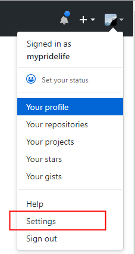
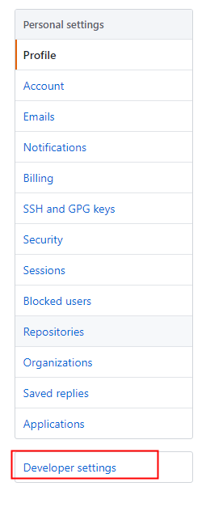
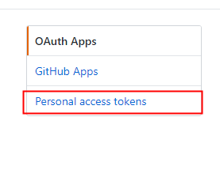
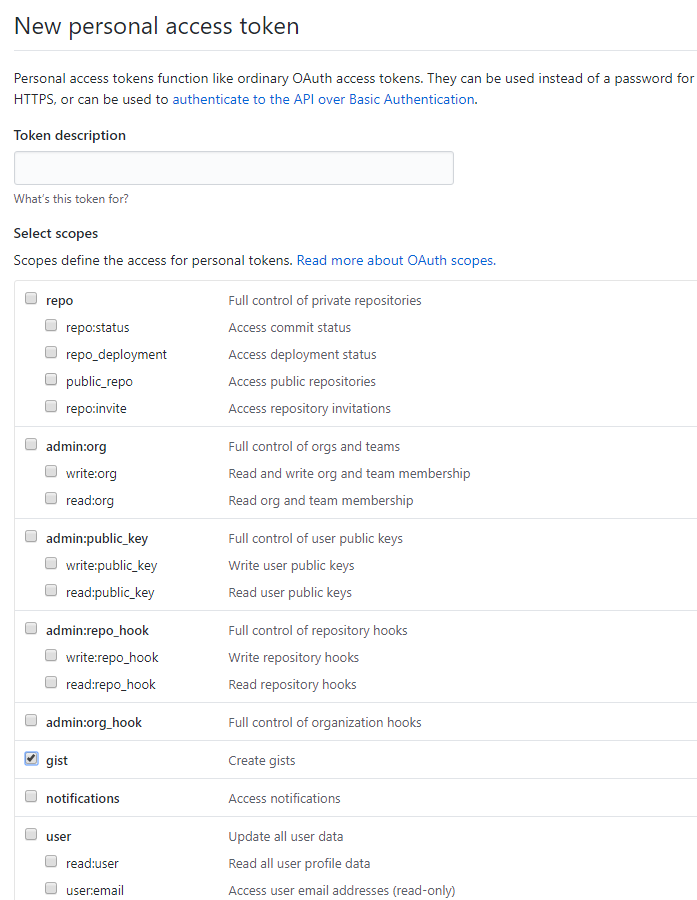
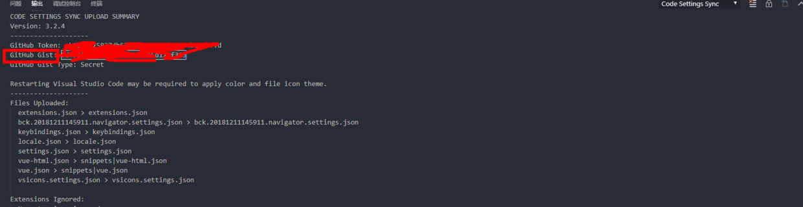

> 背景：换电脑需要重装 vscode。由于自己之前用的有很多偏好设置，也安装了很多插件，一个个的设置下载太慢了，即使复制 setting 也麻烦。

步骤：
1、生成 github 的 token
2、安装同步插件 Settings Sync
3、上传个人设置
4、同步个人设置

## 1、生成 github 的 token

user> settings > Developer settings > Personal access tokens > Generate new token

**填写 Token description，勾选 gist**

**复制生成的 token**

## 2、安装同步插件 Settings Sync

打开 vscode 安装同步插件 Settings Sync

## 3、上传个人设置

ctrl+p 输入>sync 点击 update/updload settings
输入 token 后回车

## 4、同步个人设置

第三步成功后控制台会打印信息，找到最上面 gist 的信息，复制下来。

打开另一台电脑，安装 vscode 插件之后。
ctrl+p 输入>sync 点击 Download Settings，即可。
