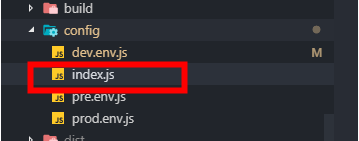
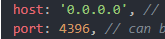

接上一篇，如果我们遇到调用钉钉的 api 的时候（钉钉登录暂不支持），如更改钉钉应用的标题栏。

[钉钉手机网页应用更改标题栏](https://www.yuque.com/hzhj/ztech/lm0zll)

这时候我们需要看效果的时候在浏览器打开是不行的，控制台会报错，提示我们需要在钉钉的环境下使用。

但是调试起来就比较麻烦，需要我们部署到服务器才可以看到效果，如果有问题还需要修改再部署。

解决办法：

1、将项目启动的 host 改为 0.0.0.0，port 随意，但要关闭本机的防火墙或者开启本机的此端口可供访问。

位置（vue-cli2.0 脚手架）：





2、查看自己本机的 ip 地址。

3、手机保证需要和电脑一个局域网。

4、手机钉钉发出一个消息，内容为项目的访问地址。如：

```
192.168.0.110:8080
```

5、点击此消息即可访问到你的项目，注意项目需要启动才可以访问。

6、此时，你调用的钉钉 api 即可生效。

注：由于手机不可打开控制台看信息，如果需要打印查看某些信息，可 alert。
