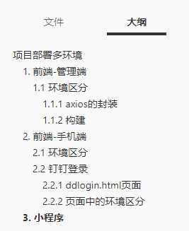

# 项目部署多环境

背景：之前项目都是在本地开发，迭代到日常环境，一次次的迭代之后，要发布到预发和正式，才有了此文。

文章结构：


## 1. 前端-管理端

以下内容基于 cli2.0

### 1.1 环境区分

#### 1.1.1 axios 的封装

talk is cheap this is the code：

文件：@/utils/request.js

```
import axios from 'axios'
import store from '@/store'
import { getToken } from '@/utils/auth'
import Cookies from 'js-cookie'

// create an axios instance
const service = axios.create({
  baseURL: process.env.BASE_API, // api 的 base_url
  timeout: 5000 // request timeout
  // withCredentials: true
})

// request interceptor
service.interceptors.request.use(
  config => {
    // Do something before request is sent
    if (window.localStorage.getItem('token')) {
    // 让每个请求携带token-- ['X-Token']为自定义key 请根据实际情况自行修改
      config.headers['X-Token'] = window.localStorage.getItem('token')
    }
    // if (Cookies.get('_traceid_')) {
    //   config.headers['X-Trace'] = Cookies.get('_traceid_')
    // }
    return config
  },
  error => {
    // Do something with request error
    console.log(error) // for debug
    Promise.reject(error)
  }
)

// response interceptor
service.interceptors.response.use(
  response => response,
  /**
   * 下面的注释为通过在response里，自定义code来标示请求状态
   * 当code返回如下情况则说明权限有问题，登出并返回到登录页
   * 如想通过 xmlhttprequest 来状态码标识 逻辑可写在下面error中
   * 以下代码均为样例，请结合自生需求加以修改，若不需要，则可删除
   */
  // response => {
  //   const res = response.data
  //   if (res.code !== 20000) {
  //     Message({
  //       message: res.message,
  //       type: 'error',
  //       duration: 5 * 1000
  //     })
  //     // 50008:非法的token; 50012:其他客户端登录了;  50014:Token 过期了;
  //     if (res.code === 50008 || res.code === 50012 || res.code === 50014) {
  //       // 请自行在引入 MessageBox
  //       // import { Message, MessageBox } from 'element-ui'
  //       MessageBox.confirm('你已被登出，可以取消继续留在该页面，或者重新登录', '确定登出', {
  //         confirmButtonText: '重新登录',
  //         cancelButtonText: '取消',
  //         type: 'warning'
  //       }).then(() => {
  //         store.dispatch('FedLogOut').then(() => {
  //           location.reload() // 为了重新实例化vue-router对象 避免bug
  //         })
  //       })
  //     }
  //     return Promise.reject('error')
  //   } else {
  //     return response.data
  //   }
  // },
  error => {
    console.log('err' + error) // for debug
    return Promise.reject(error)
  }
)

export default service
```

注释已经很清楚了，一句话来说就是封装了一个 axios 请求。最重要的三部分：

- 请求拦截
- 响应拦截
- 基础的 api_url

之后我们在统一在一个 api 的文件夹中书写请求，像这样：

```
import request from '@/utils/request'

export function loginByUsername(username, password) {
  const data = {
    username,
    password
  }
  return request({
    url: '/login/login',
    method: 'post',
    data
  })
}

export function logout() {
  return request({
    url: '/login/logout',
    method: 'post'
  })
}
```

#### 2.1.2 构建

要确定安装了 cross-env

```
npm install cross-env
```

1、先准备三个环境的文件，分别为：

- dev.env.js //日常环境
- pre.env.js // 预发环境
- prod.env.js //生产环境

内容为：

```
'use strict'
module.exports = {
  NODE_ENV: '"production"',
  ENV_CONFIG: '"prod"',
  BASE_API: '"https://api.yoururl.com"'	//填你的base_api
}
```

2、之后我们在 webpack.prod.conf.js 中配置一下 env：

```
const env = require('../config/' + process.env.env_config + '.env')
console.log(env) //可以打印一下看看是否出错
```

plugins 中的内容不变：

```
new webpack.DefinePlugin({
      'process.env': env
}),
```

3、这样配置就结束了，我们还需要设置一下打包的命令，在 package.json 中：

```
"build:prod": "cross-env NODE_ENV=production env_config=prod node build/build.js",
```

打开终端，输入命令 npm run build:prod 来测试一下吧

## 2. 前端-手机端

### 2.1 环境区分

同上管理端，不再累述。

### 2.2 钉钉登录

#### 2.2.1 ddlogin.html 页面

钉钉免登是一个单独的页面，我们放在根目录下面，ddlogin.html。

需要后端配合写两个接口，代码注释中有。具体后端内容参考钉钉开发者文档。

```
<!DOCTYPE html>
<html>
  <head>
    <meta http-equiv="Content-Type" content="text/html;charset=utf-8" />
    <meta charset="gbk" />
    <meta http-equiv="X-UA-Compatible" content="IE=edge,chrome=1" />
    <meta content="yes" name="apple-mobile-web-app-capable" />
    <meta content="black" name="apple-mobile-web-app-status-bar-style" />
    <meta content="telephone=no" name="format-detection" />
    <meta content="yes" name="apple-touch-fullscreen" />
    <meta
      name="viewport"
      content="width=device-width,initial-scale=1.0,maximum-scale=1.0,minimum-scale=1.0,user-scalable=no"
    />
    <meta
      name="viewport"
      content="width=device-width, initial-scale=1.0, minimum-scale=1.0, maximum-scale=1.0, user-scalable=0"
    />

    <title>加载中...</title>
    <script type="text/javascript"></script>
    <script type="text/javascript" src="/static/js/zepto.min.js"></script>
    <script
      type="text/javascript"
      src="https://g.alicdn.com/dingding/open-develop/1.6.9/dingtalk.js"
    ></script>
  </head>

  <body>
    <script type="text/javascript">
       var host = <%=htmlWebpackPlugin.options.ddloginapi %>;
       var configURL = host + '/dingding/config';//获取配置
       var loginURL = host + '/dingding/login';//登录


      $(function() {
        // alert("111");
        function getConfig(callback) {
          $.ajax({
            url: configURL,
            type: "get",
            data: {
              url: location.href
            },
            success: function(data, status, xhr) {
              callback(data);
            },
            error: function(xhr, errorType, error) {
              console.log(error);
            }
          });
        }

        getConfig(function(data) {
          var _config = data;

          dd.config({
            agentId: _config.agentid,
            corpId: _config.corpId,
            timeStamp: _config.timeStamp,
            nonceStr: _config.nonceStr,
            signature: _config.signature,
            jsApiList: [
              "runtime.info",
              "biz.contact.choose",
              "device.notification.confirm",
              "device.notification.alert",
              "device.notification.prompt",
              "biz.ding.post",
              "biz.util.openLink"
            ]
          });

          dd.ready(function() {
            dd.runtime.permission.requestAuthCode({
              corpId: _config.corpId,
              onSuccess: function(info) {
                $.ajax({
                  url: loginURL,
                  data: {
                    code: info.code
                  },
                  type: "POST",
                  success: function(data, status, xhr) {
                    if (data.success) {
                      window.localStorage.setItem(
                        "userName",
                        data.sysUser.name
                      );
                      window.localStorage.setItem("userId", data.sysUser.id);
                      window.localStorage.setItem("token", data.token);
                      location.href = '/?rand='+Math.random();
                    } else {
                      alert("登录失败");
                    }
                  },
                  error: function(xhr, errorType, error) {
                    alert("login error");
                  }
                });
              },
              onFail: function(err) {
                alert("onfail" + JSON.stringify(err));
              }
            });
          });

          dd.error(function(err) {
            alert("dd error: " + JSON.stringify(err));
          });
        });
      });
    </script>
  </body>
</html>

```

#### 2.2.2 页面中的环境区分

由于这个免登页面是个单页面，所以我们单独拿出来区分一下环境。做法是把域名抽离出来，通过 htmlWebpackPlugin 来获取到值。页面代码中：

```
var host = <%=htmlWebpackPlugin.options.ddloginapi %>;
```

接下来是需要我们配置的。在 webpack.prod.conf.js 中

```
new HtmlWebpackPlugin({
      filename: config.build.ddlogin,
      template: 'ddlogin.html',
      inject: false,
      title: '加载中...',
      ddloginapi: env.BASE_API, //根据不同的BASE_API获取到值
      minify: {
        removeComments: true,
        collapseWhitespace: true,
        removeAttributeQuotes: true
      }
})
```

## 3. 小程序

小程序三个版本分别对应为：

envVersion: 'develop', //开发版

envVersion: 'trial', //体验版

envVersion: 'release', //正式版

所以可通过以下代码来区分环境。

```
function version(){
  console.log('envVersion', __wxConfig.envVersion);
  let version = __wxConfig.envVersion;
  switch (version)
  {
    case 'develop':
      return 'https://测试版环境域名';
      break;
    case 'trial':
      return 'https://体验版环境域名';
      break;
    case 'release':
      return 'https://线上环境域名';
      break;
    default:
      return 'https://测试版环境域名';
  }
}

//调用
version();
```

**一个示例**

在根目录下创建 config.js，内容为：

```
let host = version();

function version() {
  console.log('envVersion', __wxConfig.envVersion);
  let version = __wxConfig.envVersion;
  switch (version) {
    case 'develop':
      return 'https://dev-cod-api.hzhengji.cn';
      break;
    case 'trial':
      return 'https://pre-cod-api.hzhengji.cn';
      break;
    case 'release':
      return 'https://cod-api.hzhengji.cn';
      break;
    default:
      return 'https://dev-cod-api.hzhengji.cn';
  }
}

let config = {
    host,
    login: `${host}/wechat/login`,	//登录
    upload: `${host}/answer/head/upload`,	//上传到oss
};
module.exports = config;
```

## 后端

后端使用的是 springboot，分离环境比较简单，三个配置文件 active 一下就可以了，不再累述。网上一搜一大把。
